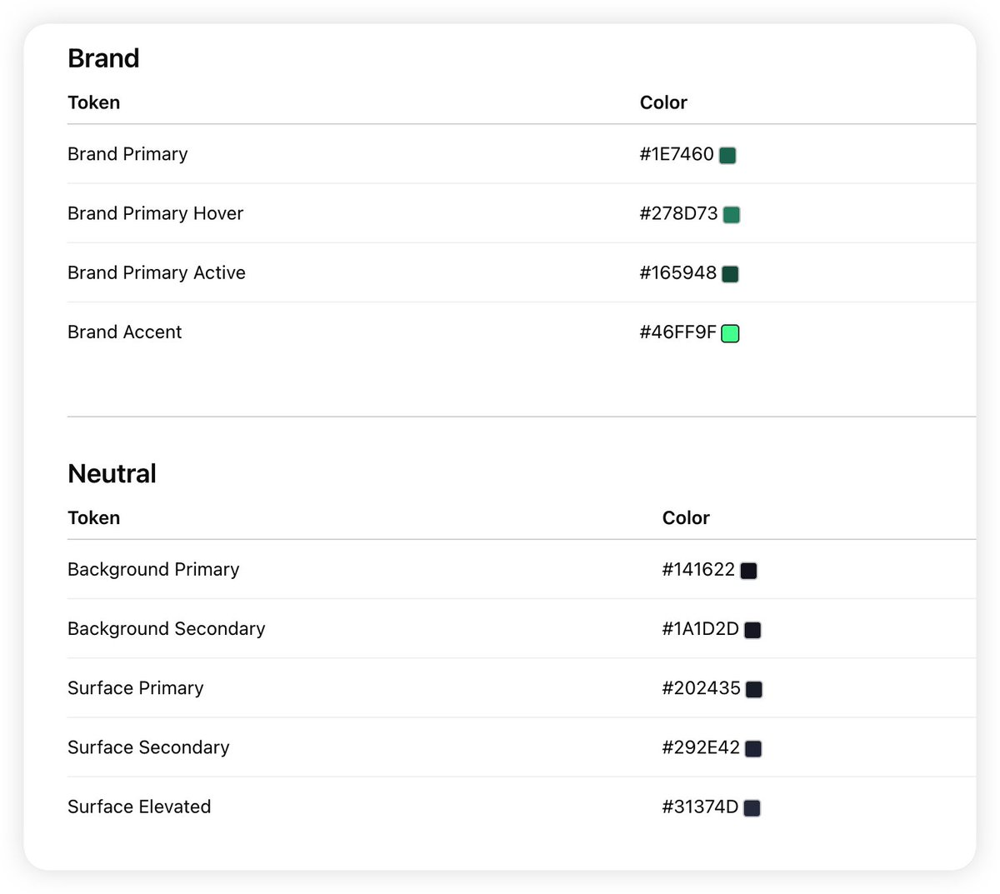
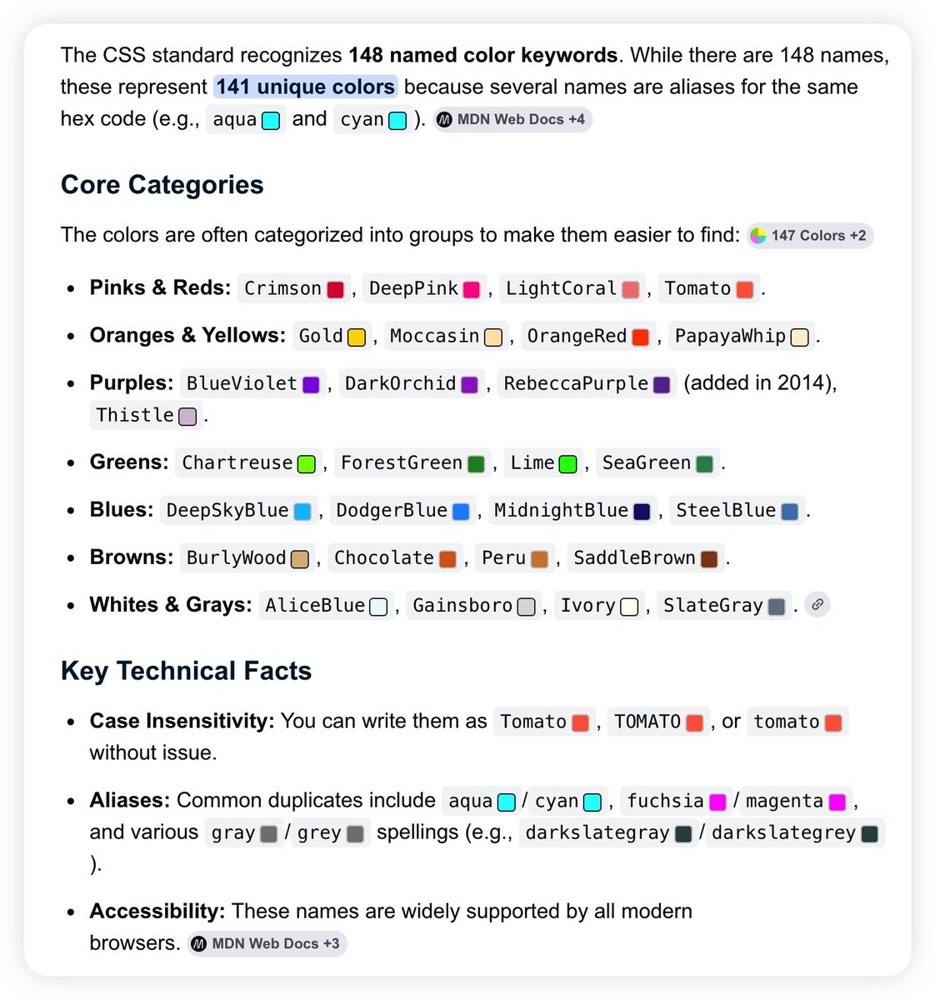

# Color Preview Swatch 🎨

> A Tampermonkey / Violentmonkey userscript that automatically detects color codes in any webpage and displays clickable color preview swatches.

[中文文档](README_zh.md)

## ✨ Features

- 🔍 **Comprehensive color detection** — Hex (`#RGB`, `#RRGGBB`, `#RGBA`, `#RRGGBBAA`), `rgb()`/`rgba()`, `hsl()`/`hsla()`, and **148 named CSS colors** with precise whitelist matching
- 🟦 **Inline color swatches** — 14×14 px rounded squares inserted next to each detected color. Background uses the original color string directly (browser's native CSS parser handles every format).
- 🏁 **Alpha transparency** — Semi-transparent colors show a checkerboard pattern underneath. HSLA/RGBA alpha channels render naturally.
- 🖱️ **Hover tooltip** — Shows the original color string plus parsed `rgba(R, G, B, A)` values (via canvas pixel readback).
- 📋 **Click to copy** — Click any swatch to copy the original color string to clipboard (with green flash feedback).
- 🌓 **Dark-mode friendly** — Swatch border automatically adapts based on color luminance (dark border on light colors, light border on dark colors).
- ⚡ **SPA-ready** — `MutationObserver` + debounce handles dynamically loaded content (React, Vue, comments, live code).
- 📝 **Code-block friendly** — Works inside `<pre>`, `<code>`, and syntax-highlighted regions.
- 🎛️ **Global toggle** — `Alt+C` or `Ctrl+Shift+C` to switch on/off; Tampermonkey menu command with live status text.
- 💾 **Persistent state** — On/off preference survives page reloads (via `GM_setValue`/`GM_getValue`).
- 🛡️ **Safe** — Skips `<script>`, `<style>`, `<input>`, `<textarea>`, and `contenteditable` areas. Named colors use negative lookbehind to avoid false matches in CSS class names (`text-red-500`, `--red`, `non-red`).

## 📸 Screenshots

<p align="center">
  
  
</p>

## 🎯 Supported Color Formats

| Format | Examples |
|--------|----------|
| Hex short | `#fff`, `#f0f8` |
| Hex long | `#ff0000`, `#ff000080` |
| RGB (comma) | `rgb(255, 99, 71)` |
| RGBA (comma) | `rgba(255, 99, 71, 0.8)` |
| RGB/RGBA (space) | `rgb(255 0 0)`, `rgba(97 95 255 / 0.8)` |
| HSL (comma) | `hsl(200, 80%, 60%)` |
| HSLA (comma) | `hsla(200, 80%, 60%, 0.7)`, `hsla(200, 80%, 60%, 50%)` |
| HSL/HSLA (space) | `hsl(200 80% 60%)`, `hsla(200 80% 60% / 0.7)` |
| Named colors | `red`, `blue`, `rebeccapurple`, `transparent` … (148 total, whitelist-matched) |

## 📦 Installation

1. Install **[Tampermonkey](https://www.tampermonkey.net/)** or **[Violentmonkey](https://violentmonkey.github.io/)** for your browser.
2. Open [`color-preview-swatch.user.js`](color-preview-swatch.user.js) and click the **Raw** button, or drag it into your script manager.
3. The script manager will prompt you to install — confirm, and you're done!

## ⌨️ Usage

| Action | Shortcut / Method |
|--------|-------------------|
| **Toggle on/off** | `Alt + C` or `Ctrl + Shift + C` |
| **Toggle via menu** | Click the Tampermonkey toolbar icon → "颜色预览：已开启 ✓" / "颜色预览：已关闭" |
| **Copy a color** | Click the swatch next to any detected color |

> **Note:** The keyboard shortcut is automatically disabled when you're typing inside an input field, textarea, or contenteditable region.

## 🔧 Compatibility

| Script Manager | Supported |
|----------------|-----------|
| Tampermonkey | ✅ Full support (menu commands, persistent state) |
| Violentmonkey | ✅ Full support |
| Greasemonkey 4+ | ⚠️ Works, but menu command may not display |

## 📁 File Structure

```
colors-preview/
├── color-preview-swatch.user.js   # The userscript
├── README.md                      # English documentation
└── README_zh.md                   # Chinese documentation
```

## 📄 License

MIT License
